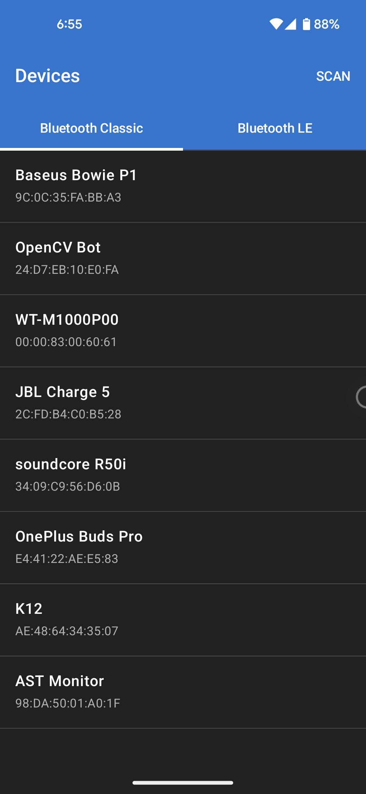
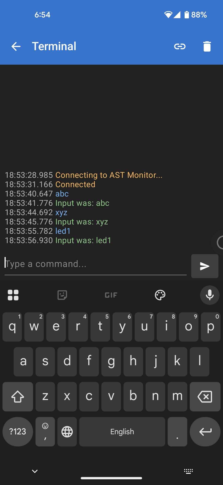

# Android-Blue-Serial

A lightweight, coroutine-powered Android library designed to simplify serial communication over Bluetooth. It supports both **Bluetooth Classic (RFCOMM)** and **Bluetooth Low Energy (LE)** connections using a unified, clean API.

---

## Screenshots

| Bluetooth Classic & LE Discovery                    | Serial Terminal Communication                           |
|-----------------------------------------------------|---------------------------------------------------------|
|  |  |

---

## Features

- **Unified API:** A clean `BluetoothConnection` interface implemented by both Classic and LE connections.
- **Coroutine Support:** Simple, suspended `connect` function that makes asynchronous connection handling straightforward.
- **Callbacks:** Real-time event notifications for incoming data reading and disconnection events.
- **Bluetooth Classic (RFCOMM):** Connects to remote classic devices using the standard Serial Port Profile (SPP) UUID (`00001101-0000-1000-8000-00805F9B34FB`) or custom UUIDs.
- **Bluetooth LE (Low Energy):** Automatic service and characteristic discovery specifically filtered to identify serial communication characteristics.
- **Zero Manifest Overhead:** The library does not force Bluetooth or Location permissions in its own manifest. You can request exactly the permissions required by your target Android version.

---

## Installation

### 1. Add Repository
Add jitpack to your `settings.gradle.kts` (or `build.gradle` for older versions):

```kotlin
dependencyResolutionManagement {
    repositories {
        google()
        mavenCentral()
        maven { url = uri("https://jitpack.io") }
    }
}
```

### 2. Add Dependency
Add the library dependency to your module's `build.gradle.kts`:

```kotlin
dependencies {
    implementation("com.github.chayanforyou:android-blue-serial:1.0.0")
}
```

Or, if integrating locally inside this multi-module project:

```kotlin
dependencies {
    implementation(project(":blue-serial"))
}
```

---

## Permissions Setup

Make sure to request and request at runtime the required Bluetooth and Location permissions in your app's `AndroidManifest.xml` depending on your target API levels:

```xml
<!-- Required for Android 11 (API 30) and below -->
<uses-permission android:name="android.permission.BLUETOOTH" android:maxSdkVersion="30" />
<uses-permission android:name="android.permission.BLUETOOTH_ADMIN" android:maxSdkVersion="30" />

<!-- Required for Android 12 (API 31) and above -->
<uses-permission android:name="android.permission.BLUETOOTH_SCAN" />
<uses-permission android:name="android.permission.BLUETOOTH_CONNECT" />

<!-- Required for Bluetooth Scanning/Discovery -->
<uses-permission android:name="android.permission.ACCESS_FINE_LOCATION" />
<uses-permission android:name="android.permission.ACCESS_COARSE_LOCATION" />
```

---

## How to Use

### 1. Initialize Callbacks
Setup callbacks to handle incoming data stream and disconnection events:

```kotlin
val readCallback = BluetoothConnectionBase.OnReadCallback { data ->
    val receivedString = String(data)
    println("Received: $receivedString")
}

val disconnectedCallback = BluetoothConnectionBase.OnDisconnectedCallback { byRemote ->
    if (byRemote) {
        println("Connection was closed by the remote device")
    } else {
        println("Connection was closed locally")
    }
}
```

### 2. Choose Connection Mode

#### Bluetooth Classic Connection
Initialize `BluetoothConnectionClassic` and connect inside a coroutine:

```kotlin
val connection = BluetoothConnectionClassic(context, readCallback, disconnectedCallback)

lifecycleScope.launch {
    try {
        // Connect to a device via MAC address
        connection.connect("00:11:22:33:44:55")
        println("Connected successfully!")
    } catch (e: IOException) {
        println("Connection failed: ${e.message}")
    }
}
```

#### Bluetooth LE (Low Energy) Connection
Initialize `BluetoothConnectionLE` and connect inside a coroutine:

```kotlin
val connection = BluetoothConnectionLE(context, readCallback, disconnectedCallback)

lifecycleScope.launch {
    try {
        // Connect to an LE device via MAC address
        connection.connect("00:11:22:33:44:55")
        println("Connected to LE device!")
    } catch (e: IOException) {
        println("Connection failed: ${e.message}")
    }
}
```

### 3. Write / Send Data
Send data to the connected device:

```kotlin
try {
    val message = "Hello Serial Device!"
    connection.write(message.toByteArray())
} catch (e: IOException) {
    println("Failed to send data: ${e.message}")
}
```

### 4. Disconnect
Disconnect the session:

```kotlin
connection.disconnect()
```

---

## License

```text
MIT License

Copyright (c) 2026 Chayan

Permission is hereby granted, free of charge, to any person obtaining a copy
of this software and associated documentation files (the "Software"), to deal
in the Software without restriction, including without limitation the rights
to use, copy, modify, merge, publish, distribute, sublicense, and/or sell
copies of the Software, and to permit persons to whom the Software is
furnished to do so, subject to the following conditions:
...
```
